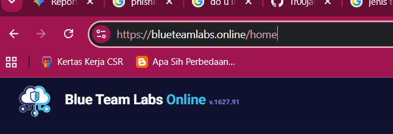
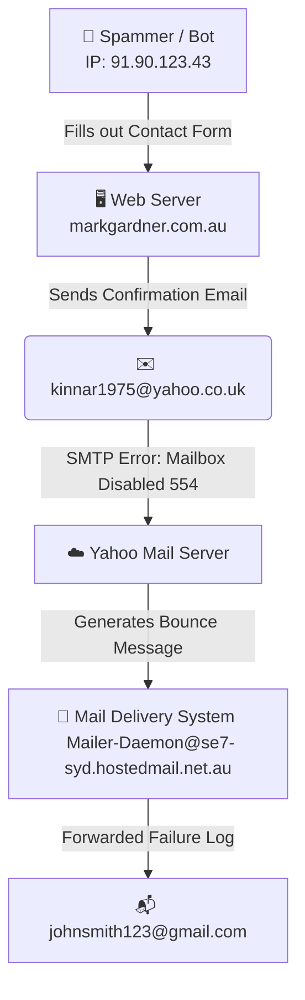

# 🛡️ Blue Team Labs Online (BTLO) — Phishing Analysis Walkthrough

<p align="center">
  
</p>

---

## 👨‍💻 Student Profile
| Field | Details |
| :--- | :--- |
| **Name** | **SYAFIQ RIDZUAN** |
| **Student ID** | `52215125897` |
| **Lab Challenge** | **Phishing Analysis** |

---

## 📊 Challenge Metadata

<p align="left">
  
  
  
  
</p>

---

## 🏆 Completion Certificate

<p align="center">
  
</p>

---

## 📧 Scenario & Email Flow Diagram

### 📖 Scenario Context
In this lab, we analyze a suspicious `.eml` file. A spammer abused a website contact form to submit a promotional scam. The host web server attempted to send an automatic confirmation copy of this submission to the spammer's email address. However, because that target mailbox was disabled, a bounce message (undeliverable notification) was generated and returned, which was eventually forwarded to the site owner/analyst.

### 🗺️ Mail Flow Diagram


---

## 🛠️ Phase 1: Setup & Environment Prep

### 📥 Step 1.1: Download Lab Files
1. Log in to [Blue Team Labs Online](https://blueteamlabs.online/).
2. Navigate to the **Phishing Analysis** challenge and download the `.zip` archive.
3. Extract the archive using the platform-default password: `btlo`.
4. This yields the file: `Website contact form submission.eml`.

### 🛡️ Step 1.2: Safe Analysis Guidelines
> [!WARNING]
> Never open suspicious files or click nested URLs on your host machine. Always execute analyses in a secure text editor (e.g., VS Code) or inside a dedicated sandboxed environment.

*   **Primary Tool:** VS Code / Notepad++ (for raw text inspection)
*   **Secondary Tool:** CyberChef (for safe URL decoding/de-obfuscation)
*   **Safety Tool:** URL2PNG / Browserling (for sandboxed webpage screenshots)

---

## 🔍 Phase 2: Step-by-Step Investigation & Answers

### 🚩 Question 1: Who is the primary recipient of this email?
*   **Methodology:** Open the `.eml` file. Inspect the outer structure of the bounce message. Under the `Mailer-Daemon` section (around **Line 105**), look for the target recipient:
    ```text
    To: kinnar1975@yahoo.co.uk <kinnar1975@yahoo.co.uk>
    ```
*   **Explanation:** Even though the outer mail log shows delivery to `johnsmith123@gmail.com`, the actual primary target/recipient of the failed communication was `kinnar1975@yahoo.co.uk`.
*   **Answer:** `kinnar1975@yahoo.co.uk`

---

### 🚩 Question 2: What is the subject of this email?
*   **Methodology:** Locate the `Subject` header of the undeliverable bounce message (**Line 106** in plain text / **Line 143** in HTML):
    ```text
    Subject: Undeliverable: Website contact form submission
    ```
*   **Answer:** `Undeliverable: Website contact form submission`

---

### 🚩 Question 3: What is the date and time the email was sent?
*   **Methodology:** Locate the delivery timestamp of the bounce notification (**Line 104**):
    ```text
    Sent: 18 March 2021 04:14
    ```
*   **Required Format:** `DD MonthName YYYY HH:MM`
*   **Answer:** `18 March 2021 04:14`

---

### 🚩 Question 4: What is the Originating IP?
*   **Methodology:** Scroll down to the attached email headers (the nested RFC822 email block starting around **Line 170**). Identify the `X-Originating-IP` header on **Line 202**:
    ```text
    X-Originating-IP: 103.9.171.10
    ```
*   **Answer:** `103.9.171.10`

---

### 🚩 Question 5: Perform reverse DNS on this IP address, what is the resolved host?
*   **Methodology:** Run a reverse lookup using a service (like WHOIS) or check the corresponding `Received` header in the attachment block (**Line 176**):
    ```text
    Received: from c5s2-1e-syd.hosting-services.net.au ([103.9.171.10])
    ```
*   **Answer:** `c5s2-1e-syd.hosting-services.net.au`

---

### 🚩 Question 6: What is the name of the attached file?
*   **Methodology:** Examine the attachment structure headers (**Line 170-174**). The nested email is parsed as an attachment.
*   **Answer:** `Website contact form submission.eml`

---

### 🚩 Question 7: What is the URL found inside the attachment?
*   **Methodology:** Read the body of the nested contact form attachment (**Lines 245-247**). The message content includes a concatenated spam URL:
    ```text
    https://35000usdperwwekpodf.blogspot.sg?p=9swghttps://35000usdperwwekpodf.blogspot.co.il?o=0hnd
    ```
*   **Answer:** `https://35000usdperwwekpodf.blogspot.sg?p=9swghttps://35000usdperwwekpodf.blogspot.co.il?o=0hnd`

---

### 🚩 Question 8: What service is this webpage hosted on?
*   **Methodology:** Inspect the primary domain name in the spam link (`blogspot.sg` and `blogspot.co.il`), which belongs to Google's blog publishing platform.
*   **Answer:** `blogspot` (or `Blogger`)

---

### 🚩 Question 9: Using URL2PNG, what is the heading text on this page?
*   **Methodology:** Query the malicious link using the sandboxed screenshot tool **URL2PNG**. The generated screenshot of the terminated blog will show the removal notice.
*   **Answer:** `Blog has been removed`

---

## 🏆 Consolidated Challenge Answers

Below is the summary list of solutions to submit in the BTLO portal:

| Question | Flag / Answer | Format |
| :--- | :--- | :--- |
| **1. Recipient** | `kinnar1975@yahoo.co.uk` | `mailbox@domain.tld` |
| **2. Subject** | `Undeliverable: Website contact form submission` | Text |
| **3. Date & Time** | `18 March 2021 04:14` | `DD MonthName YYYY HH:MM` |
| **4. Originating IP** | `103.9.171.10` | `X.X.X.X` |
| **5. Reverse DNS** | `c5s2-1e-syd.hosting-services.net.au` | Domain Name |
| **6. Attached File** | `Website contact form submission.eml` | `filename.extension` |
| **7. Malicious URL** | `https://35000usdperwwekpodf.blogspot.sg?p=9swghttps://35000usdperwwekpodf.blogspot.co.il?o=0hnd` | Full URL |
| **8. Hosting Service**| `blogspot` | Service Name |
| **9. Heading Text** | `Blog has been removed` | Page Heading |

---

## 💡 Key Takeaways for SOC Analysts
1.  **Detect Backscatter / Bounce Abuse:** Spammers frequently fill out public forms with invalid/disabled target addresses to trigger bounce mails. This results in the target receiving notification "backscatter", bypassing standard filters.
2.  **Examine Nested RFC822 Blocks:** When analyzing system bounce mail files, core malicious artifacts (such as the IP address, original headers, and embedded links) reside inside the nested attachments.
3.  **Perform Passive OSINT:** Always leverage passive analysis resources (like WHOIS records, DNS tools, and screenshot rendering engines) to preview potential payload destinations securely.
