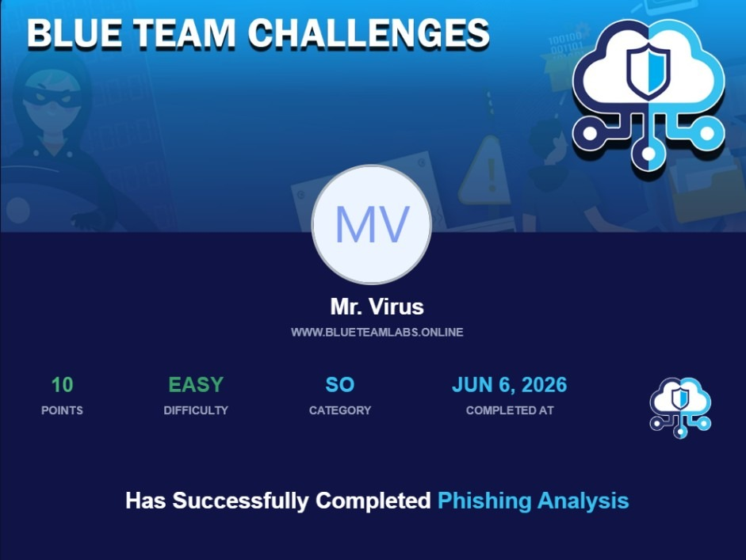

# Blue Team Labs Online (BTLO) — Phishing Analysis Walkthrough

This repository contains a professional write-up and step-by-step investigation walkthrough for the **Phishing Analysis** challenge on [Blue Team Labs Online (BTLO)](https://blueteamlabs.online/).



## Challenge Details

*   **Platform:** Blue Team Labs Online (BTLO)
*   **Difficulty:** Easy
*   **Category:** Security Operations (SO)
*   **Points:** 10 Points

---

## Scenario Overview

As a security analyst, you are tasked with analyzing a suspicious email file (`.eml`) that was captured. The objective is to perform email header analysis, extract key metadata (such as sender/recipient addresses, timestamps, and originating IPs), investigate the mail flow (bounces/failures), and inspect any malicious attachments or links contained within.

---

## Investigation Walkthrough

### Step 1: Open and Inspect the `.eml` File
To start the analysis safely, open the `.eml` file in a text editor (such as VS Code, Notepad++) or a mail client configured in a sandboxed environment (such as Mozilla Thunderbird). Viewing the raw source code of the email allows you to see the exact headers and multi-part boundaries.

### Step 2: Determine the Primary Recipient and Subject
Looking at the bounce message headers in the text editor:
*   We find a bounce message (delivery status notification) generated by the mail delivery system:
    ```text
    From: Mail Delivery System <Mailer-Daemon@se7-syd.hostedmail.net.au>
    Sent: 18 March 2021 04:14
    To: kinnar1975@yahoo.co.uk <kinnar1975@yahoo.co.uk>
    Subject: Undeliverable: Website contact form submission
    ```
*   The primary recipient of the undeliverable email was **`kinnar1975@yahoo.co.uk`**.
*   The subject of this bounce message is **`Undeliverable: Website contact form submission`**.

> [!NOTE]
> Although the outer `.eml` file was eventually delivered to `johnsmith123@gmail.com`, the actual target and primary recipient of the failed email/bounce notification was `kinnar1975@yahoo.co.uk`.

### Step 3: Identify the Sent Timestamp
*   Under the Mailer-Daemon header block, we see the delivery failure timestamp:
    `Sent: 18 March 2021 04:14`
*   Following the format `DD MonthName YYYY HH:MM`, this translates to: **`18 March 2021 04:14`**.

### Step 4: Extract the Originating IP and Perform Reverse DNS
Scroll down to the attached message headers (`Content-Type: message/rfc822`), which contain the original spam email headers sent from the web server:
*   Look for the `X-Originating-IP` header:
    `X-Originating-IP: 103.9.171.10`
*   Therefore, the Originating IP is **`103.9.171.10`**.
*   To perform a reverse DNS lookup, examine the `Received` header corresponding to this IP:
    `Received: from c5s2-1e-syd.hosting-services.net.au ([103.9.171.10]) ...`
*   The resolved host is **`c5s2-1e-syd.hosting-services.net.au`**.

### Step 5: Analyze the Attachment and Malicious Link
The email contains an attachment with a nested `.eml` message showing the website form submission:
*   The name of the attached file is **`Website contact form submission.eml`**.
*   Inside the body of the attachment, we find the following spam text:
    `Good earnings from $6500 per day >>>>>>>>>>     https://35000usdperwwekpodf.blogspot.sg?p=9swghttps://35000usdperwwekpodf.blogspot.co.il?o=0hnd   <<<<<<<<<<<`
*   The malicious URL found inside is **`https://35000usdperwwekpodf.blogspot.sg?p=9swghttps://35000usdperwwekpodf.blogspot.co.il?o=0hnd`**.
*   This webpage is hosted on the **`blogspot`** (or Blogger) service.

### Step 6: Safe Website Preview via URL2PNG
Using a safe screenshotting tool like **URL2PNG** to preview the Blogspot page without loading it directly in a browser reveals that the blog was taken down by the host. 
*   The heading text displayed on the page is: **`Blog has been removed`**.

---

## Challenge Submission Q&A

| # | Question | Answer | Format |
|---|---|---|---|
| 1 | Who is the primary recipient of this email? | `kinnar1975@yahoo.co.uk` | `mailbox@domain.tld` |
| 2 | What is the subject of this email? | `Undeliverable: Website contact form submission` | Text |
| 3 | What is the date and time the email was sent? | `18 March 2021 04:14` | `DD MonthName YYYY HH:MM` |
| 4 | What is the Originating IP? | `103.9.171.10` | `X.X.X.X` |
| 5 | Perform reverse DNS on this IP address, what is the resolved host? | `c5s2-1e-syd.hosting-services.net.au` | Host Name |
| 6 | What is the name of the attached file? | `Website contact form submission.eml` | `filename.extension` |
| 7 | What is the URL found inside the attachment? | `https://35000usdperwwekpodf.blogspot.sg?p=9swghttps://35000usdperwwekpodf.blogspot.co.il?o=0hnd` | Full URL |
| 8 | What service is this webpage hosted on? | `blogspot` | Service Name |
| 9 | Using URL2PNG, what is the heading text on this page? | `Blog has been removed` | Heading Text |

---

## Tools Used During Analysis

1.  **Text Editor (VS Code / Notepad++)** — Used to safely open the raw `.eml` headers.
2.  **MXToolbox / DomainTools** — Used for performing WHOIS and reverse DNS (rDNS) lookups on the originating server IP address.
3.  **URL2PNG / Sandbox Browser** — Used for safely screenshotting the destination site without risking malware infection.

---

*Disclaimer: This walkthrough is for educational and training purposes only. Always use isolated environments/VMs when analyzing real phishing artifacts.*
